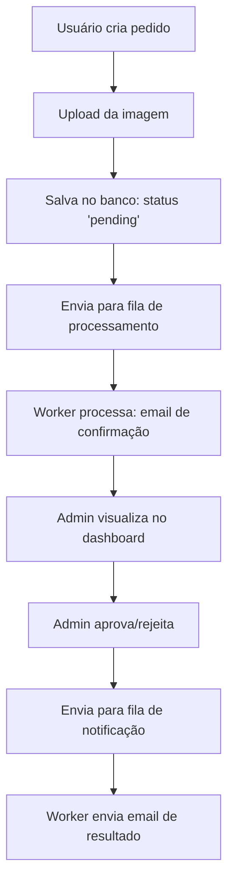

# 📦 Sistema de Processamento de Pedidos

<div align="center">

**Uma API robusta para gerenciamento de pedidos com upload de comprovantes, processamento assíncrono e notificações por email**


</div>

---

## 🎯 Sobre o Projeto

Este sistema foi desenvolvido para gerenciar pedidos com upload de comprovantes, oferecendo uma experiência completa desde a criação até a aprovação/rejeição por administradores. A aplicação utiliza um monolito modular com processamento assíncrono, notificações automáticas por email e uma interface de administração robusta.

### ✨ Características Principais
- **🔒 Autenticação JWT** com controle de acesso baseado em roles
- **📤 Upload de Imagens** com armazenamento em nuvem (Cloudinary)
- **⚡ Processamento Assíncrono** com filas BullMQ e Redis
- **📧 Notificações por Email** automáticas para todas as mudanças de status
- **📊 Dashboard Admin** para gerenciamento completo de pedidos
- **🧪 Testes Automatizados** com cobertura completa (E2E e unitários)
- **📖 Documentação Swagger** cobrindo todas as rotas
- **🔍 Auditoria Completa** com logs estruturados e rastreamento

---

## 🏗️ Arquitetura

### 📁 Estrutura do Projeto
```
src/
├── controllers/          # Controladores (HTTP handlers)
├── services/            # Regras de negócio
├── repositories/        # Acesso a dados (Prisma/In-Memory)
├── middlewares/         # Middlewares (auth, validation, upload)
├── schemas/            # Validações Zod
├── queues/             # Filas BullMQ e workers
├── lib/                # Configurações (Prisma, Redis, Cloudinary)
└── @types/             # Definições de tipos TypeScript
```

### �️ Stack Tecnológica

#### Backend Core
- **Node.js 18+** - Runtime JavaScript
- **TypeScript 5.6+** - Tipagem estática
- **Express 4.21** - Framework web
- **Prisma 6.7** - ORM e migrações
- **PostgreSQL** - Banco de dados principal

#### Autenticação & Segurança
- **JWT** - Tokens de autenticação
- **Bcrypt** - Hash de senhas
- **Zod** - Validação de schemas
- **CORS** - Controle de acesso

#### Processamento Assíncrono
- **BullMQ 5.56** - Sistema de filas
- **Redis 7+** - Broker de mensagens
- **IORedis 5.6** - Cliente Redis otimizado

#### Upload & Armazenamento
- **Multer** - Upload de arquivos
- **Cloudinary** - Armazenamento de imagens em nuvem

#### Email & Notificações
- **Nodemailer 7.0** - Envio de emails
- **Templates HTML** personalizados

#### Logs & Monitoramento
- **Winston 3.17** - Sistema de logs
- **Winston Daily Rotate** - Rotação automática de logs
- **Bull Board** - Dashboard de filas

#### Testes
- **Vitest 3.1** - Framework de testes
- **Supertest** - Testes de integração
- **Vitest UI** - Interface gráfica para testes

#### Documentação
- **Swagger UI Express** - Documentação interativa
- **8 Temas Personalizados** - Interface customizável

#### DevOps
- **Docker & Docker Compose** - Containerização
- **Biome** - Linter e formatter
- **TSX** - Execução TypeScript
- **TSUP** - Build otimizado

---

## � Funcionalidades

### 👤 Usuário Comum
- ✅ **Registro e Autenticação** - Criar conta e fazer login
- ✅ **Criar Pedidos** - Upload de imagens com validação
- ✅ **Visualizar Pedidos** - Listar e acompanhar status
- ✅ **Notificações Email** - Receber atualizações automáticas

### 🔧 Administrador
- ✅ **Dashboard Completo** - Visualizar todos os pedidos
- ✅ **Gerenciar Status** - Aprovar, rejeitar ou processar pedidos
- ✅ **Sistema de Auditoria** - Registrar todas as ações
- ✅ **Notificações Automáticas** - Emails para usuários sobre mudanças

### 🎛️ Sistema
- ✅ **Processamento Assíncrono** - Filas para tarefas pesadas
- ✅ **Logs Estruturados** - Auditoria e debugging
- ✅ **Health Checks** - Monitoramento de saúde da API
- ✅ **Rate Limiting** - Proteção contra abuso

---

## 📊 Modelo de Dados

### User
```typescript
{
  id: string           // UUID único
  name: string         // Nome completo
  email: string        // Email único
  password: string     // Hash bcrypt
  role: 'user' | 'admin'  // Papel no sistema
  createdAt: Date      // Data de criação
}
```

### Order
```typescript
{
  id: string           // UUID único
  userId: string       // Referência ao usuário
  title: string        // Título do pedido
  description: string  // Descrição detalhada
  imageUrl: string     // URL da imagem no Cloudinary
  status: 'pending' | 'processing' | 'approved' | 'rejected'
  createdAt: Date      // Data de criação
  updatedAt: Date      // Última atualização
}
```

---

## � Fluxo de Processamento



---

## � Pré-requisitos

### Ambiente de Desenvolvimento
- **Node.js 18+** 
- **npm 9+** ou **yarn 1.22+**
- **Docker & Docker Compose** (recomendado)
- **Git**

### Serviços Externos
- **Conta Cloudinary** (para upload de imagens)
- **Servidor SMTP** ou **Gmail** (para envio de emails)

### Bancos de Dados
- **PostgreSQL 15+** (produção)
- **Redis 7+** (filas e cache)

---

## ⚙️ Configuração

### 1. Clone o Repositório
```bash
git clone https://github.com/Gaaaybe/sistema-de-processamento-de-pedidos.git
cd sistema-de-processamento-de-pedidos
```

### 2. Instale as Dependências
```bash
npm install
```

### 3. Configure as Variáveis de Ambiente
```bash
cp .env.example .env
```

**Edite o arquivo `.env`:**

## 🏃‍♂️ Como Executar

### Desenvolvimento
```bash
# API principal
npm run start:dev

# Worker de emails (em outro terminal)
npm run start:worker:dev
```

### Produção
```bash
# Build da aplicação
npm run build

# Executar
npm start
```

### Docker (Recomendado)
```bash
# Subir todos os serviços
docker compose up -d

# Ver logs
docker compose logs -f api

# Worker de emails (em outro terminal)
npm run start:worker:dev ou prod
```

---

## 🧪 Testes

### Testes Unitários
```bash
# Executar todos os testes unitarios
npm test

# Testes em modo watch
npm run test:watch
```

### Testes E2E
```bash
# Subir banco de teste + executar testes
npm run test:e2e:all

# Apenas testes de usuários
npm run test:e2e:users

# Apenas testes de pedidos
npm run test:e2e:orders
```

### Interface de Testes
```bash
# Vitest UI para testes interativos
npm run test:e2e
```

---

## 📚 Documentação da API

### Swagger UI Interativo
```bash
# Executar a aplicação
npm run start:dev

# Acessar documentação
http://localhost:3001/api-docs
```

### Dashboard de Filas
```bash
# Monitorar filas BullMQ
http://localhost:3001/admin/queues
```

### Principais Endpoints

#### Autenticação
- `POST /users` - Registrar usuário
- `POST /users/authenticate` - Login

#### Pedidos (Usuário)
- `GET /orders` - Listar meus pedidos
- `POST /orders` - Criar pedido (com upload)

#### Administração
- `GET /admin/orders` - Listar todos os pedidos
- `PATCH /admin/orders/:id/status` - Atualizar status

---

## 🗂️ Collection Postman

Importe o arquivo `Sistema-Pedidos-API.postman_collection.json` para ter acesso a:

- ✅ **36 testes automatizados**
- ✅ **Variáveis dinâmicas** (tokens, IDs)
- ✅ **Cenários de sucesso e erro**
- ✅ **Testes de autorização**
- ✅ **Scripts de automação**

### Fluxo de Teste Recomendado:
1. **Registrar usuários** (comum + admin)
2. **Autenticar** e salvar tokens
3. **Criar pedido** com upload
4. **Admin aprovar/rejeitar**
5. **Verificar notificações**

---

## � Segurança

### Implementações de Segurança
- ✅ **Hash de senhas** com bcrypt (salt rounds: 12)
- ✅ **JWT com expiração** configurável
- ✅ **Validação de entrada** com Zod
- ✅ **Middleware de autenticação** para rotas protegidas
- ✅ **Controle de acesso** baseado em roles
- ✅ **Sanitização de uploads** (tipos e tamanhos)
- ✅ **CORS configurado** para origem específica
- ✅ **Headers de segurança** (Content-Type, etc.)

---

## 📈 Monitoramento

### Logs Disponíveis
- **app.log** - Logs da aplicação
- **error.log** - Apenas erros
- **audit.log** - Auditoria de ações

### Métricas Importantes
- Response time das APIs
- Status das filas BullMQ
- Conexões de banco de dados
- Uso de memória Redis

---

## 🤝 Contribuição

### Como Contribuir
1. Fork o projeto
2. Crie uma branch para sua feature (`git checkout -b feat/seu-nome/nova-feature`)
3. Commit suas mudanças (`git commit -m 'feat: adiciona nova feature'`)
4. Push para a branch (`git push origin feat/seu-nome/nova-feature`)
5. Abra um Pull Request

### Padrões de Código
- **TypeScript strict mode**
- **Biome** para linting e formatação
- **Conventional Commits** para mensagens
- **Testes obrigatórios** para novas features

---

## � Licença

Este projeto está sob a licença **ISC**. Veja o arquivo [LICENSE](LICENSE) para detalhes.

---

## 👨‍� Autor

**Gabriel Menezes**
- GitHub: [@Gaaaybe](https://github.com/Gaaaybe)
- Email: gabenesus@gmail.com

---

## 🚀 Roadmap

### Próximas Features
- [ ] **Dashboard web** para administradores
- [ ] **API de relatórios** com filtros avançados
- [ ] **Notificações push** em tempo real
- [ ] **Integração com WhatsApp** Business
- [ ] **Sistema de tags** para categorização
- [ ] **Aprovação em lote** para admins
- [ ] **Histórico de mudanças** detalhado
- [ ] **API pública** com rate limiting

### Melhorias Técnicas
- [ ] **Cache Redis** para consultas frequentes
- [ ] **Paginação** otimizada
- [ ] **Compressão de imagens** automática
- [ ] **Microserviços** para escala (Futuro distante)

---

<div align="center">

**⭐ Se este projeto foi útil, deixe uma estrela!**

Made with ❤️ by [Gabriel Menezes](https://github.com/Gaaaybe)

</div>
